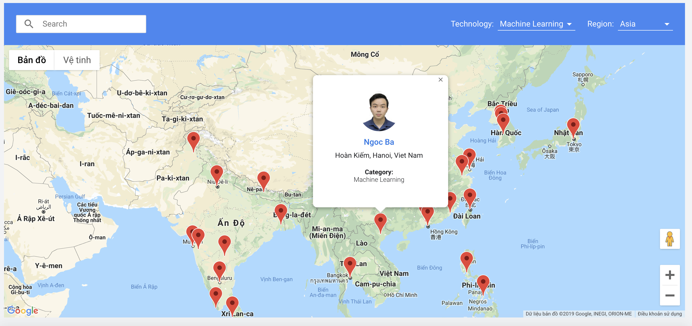

## Lộ trình học Machine Learning, Deep Learning cho người mới bắt đầu

Tôi đã từng học Machine Learning trong vòng 2 tháng và tôi tin bạn cũng có thể làm được. 

Lộ trình sẽ giúp bạn nắm chắc công nghệ này từ cơ bản đến nâng cao, xây dựng Machine Learning model từ python thuần cho đến các thư viện cao cấp như TensorFlow hay Keras. Đi sâu phân tích bản chất vấn đề là giá trị cốt lõi của khóa học này.

**P/S:** Hãy để lại **1 star** để team có động lực xuất bản các phần tiếp theo và cũng đừng quên chia sẻ tới bạn bè của bạn.

Tôi là một trong các lecturer của lớp VietAI Hanoi khoá 3 và khoá 4. Hiện tại tôi đã vào Sài Gòn nên không tham gia tiếp để giảng dạy nhưng vẫn đóng vai trò Advisor cho lớp khoá 5.

Ngày 10/12/2019, sau 2 vòng phỏng vấn, Google chính thức công nhận tôi là Google Developer Expert in Machine Learning. Tôi nghĩ tôi là ML GDE đầu tiên tại Việt Nam.

Tìm tôi [ở đây](https://developers.google.com/community/experts/directory).

Video giới thiệu về Machine Learning:

Giới thiệu về thành tựu và mục tiêu của VietAI [tại đây](https://docs.google.com/presentation/d/1A_oDWZyC6NhYPeHNrWJbESxSPUT7f0Gg-PLfXDtVKus/edit?usp=sharing). 

### Mục lục
----
- <a href="./math">1. Kiến thức toán học cần thiết</a> (Hoàn tất)
- <a href="./python-tutorials">2. Kỹ năng lập trình Python</a> (Hoàn tất)
- <a href="./numpy">3. Thư viện Numpy và TensorFlow</a> (Hoàn tất)
- <a href="./models/visualize">4. Hiển thị dữ liệu và các công cụ</a> (Đang tiến hành)
- <a href="./models/linear-regression/">5. Bài toán hồi quy (Regression)</a> (Hoàn tất)
- <a href="./models/logistic-regression">6. Bài toán phân loại (Classification)</a> (Hoàn tất)
- <a href="./deployment/distributed-tensorflow">7. Triển khai (Deploy) Machine Learning Model trên Production</a> (Hoàn tất)
- <a href="./deployment/tensorflow-browser">8. Machine Learning trên trình duyệt và TensorFlowJS</a> (Hoàn tất)
- <a href="./tf2.0">9. Cập nhật mới nhất</a>
    - [TensorFlow 2.0](https://github.com/bangoc123/learn-machine-learning-in-two-months/tree/master/tf2.0)
    - [Trải nghiệm PaperSpace Gradient Community](https://github.com/bangoc123/learn-machine-learning-in-two-months/tree/master/articles/GradientPaperSpace.MD)
- <a href="./algorithms">10. Ôn luyện thuật toán mỗi ngày</a> (Đang tiến hành)
    - [Backtracking Algorithm](./algorithms/graph/backtracking/backtracking.MD)