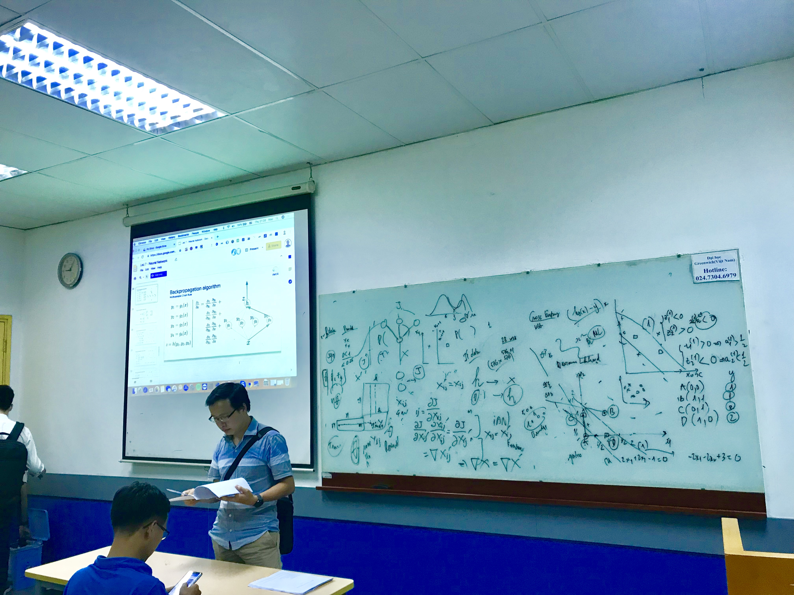

## Lộ trình học Machine Learning, Deep Learning cho người mới bắt đầu

Tôi đã từng học Machine Learning trong vòng 2 tháng và tôi tin bạn cũng có thể làm được. 

Lộ trình sẽ giúp bạn nắm chắc công nghệ này từ cơ bản đến nâng cao, xây dựng Machine Learning model từ python thuần cho đến các thư viện cao cấp như TensorFlow hay Keras. Đi sâu phân tích bản chất vấn đề là giá trị cốt lõi của khóa học này.

**P/S:** Hãy để lại **1 star** để team có động lực xuất bản các phần tiếp theo và cũng đừng quên chia sẻ tới bạn bè của bạn.

Tôi là một trong các lecturer của lớp VietAI Hanoi khoá 3 và khoá 4. Hiện tại tôi đã vào Sài Gòn nên không tham gia tiếp để giảng dạy nhưng vẫn đóng vai trò Advisor cho lớp khoá 5.

Bài giảng tôi thích dạy nhất ở VietAI chính là mạng Neural Network.

Giới thiệu về thành tựu và mục tiêu của VietAI [tại đây](https://docs.google.com/presentation/d/1A_oDWZyC6NhYPeHNrWJbESxSPUT7f0Gg-PLfXDtVKus/edit?usp=sharing). 

### Mục lục
----
- <a href="https://github.com/bangoc123/learn-machine-learning-in-two-months/tree/master/math">1. Kiến thức toán học cần thiết</a> (Hoàn tất)
- <a href="https://github.com/bangoc123/learn-machine-learning-in-two-months/tree/master/python-tutorials">2. Kỹ năng lập trình Python</a> (Hoàn tất)
- <a href="https://github.com/bangoc123/learn-machine-learning-in-two-months/tree/master/numpy">3. Thư viện Numpy và TensorFlow</a> (Hoàn tất)
- <a href="https://github.com/bangoc123/learn-machine-learning-in-two-months/blob/master/models/linear-regression/">4. Bài toán hồi quy (Regression)</a> (Hoàn tất)
- <a href="https://github.com/bangoc123/learn-machine-learning-in-two-months/blob/master/models/logistic-regression">5. Bài toán phân loại (Classification)</a> (Đang tiến hành)
- <a href="https://github.com/bangoc123/learn-machine-learning-in-two-months/blob/master/models/random-forests">6. Xây dựng mô hình Decision Trees và Random Forests </a> (Chưa Hoàn tất)
- <a href="https://github.com/bangoc123/learn-machine-learning-in-two-months/tree/master/models/nn">7. Xây dựng mạng Neural Network</a> (Đang tiến hành)
- <a href="https://github.com/bangoc123/learn-machine-learning-in-two-months/tree/master/models/cnn">8. Xây dựng mạng Convolutional Neural Network (CNN)</a> (Chưa Hoàn tất)
- <a href="https://github.com/bangoc123/learn-machine-learning-in-two-months/tree/master/models/rnn">9. Xây dựng mạng Recurrent Neural Network (RNN)</a> (Chưa Hoàn tất)
- <a href="https://github.com/bangoc123/learn-machine-learning-in-two-months/tree/master/gan">11. Mô hình sinh GAN và CycleGAN</a> (Đang tiến hành)
- <a href="https://github.com/bangoc123/learn-machine-learning-in-two-months/tree/master/deployment/distributed-tensorflow">11. Triển khai (Deploy) Machine Learning Model trên Production</a> (Đang tiến hành)
- <a href="https://github.com/bangoc123/learn-machine-learning-in-two-months/tree/master/deployment/tensorflow-browser">11. Machine Learning trên trình duyệt và TensorFlowJS</a> (Chưa Hoàn tất)
