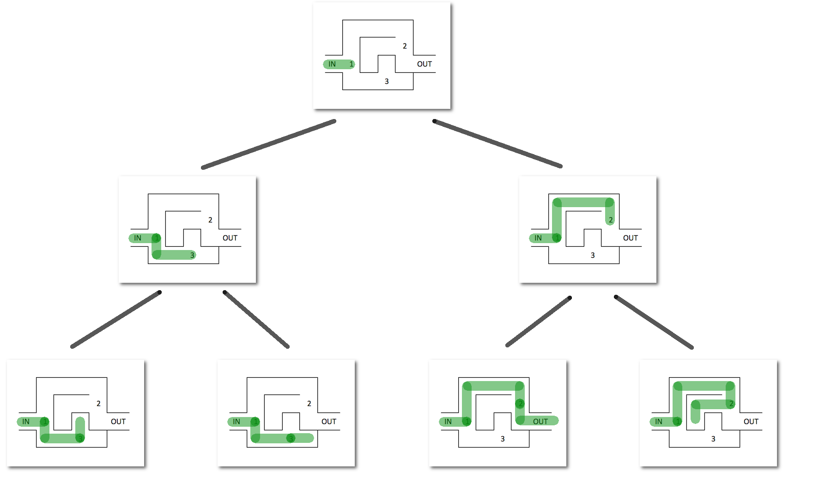
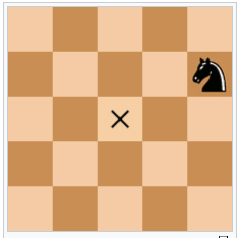
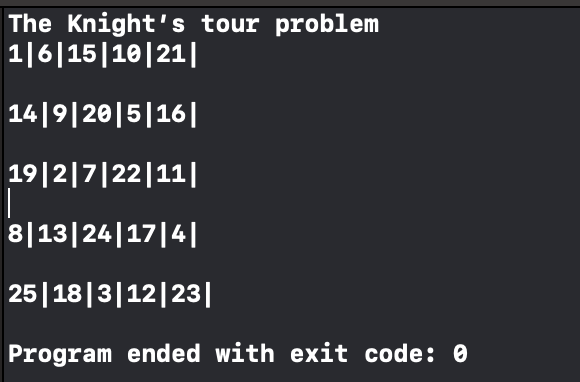

### Thuật toán Quay lui (Backtracking) với bài toán con mã đi hết bản đồ.


Bài toán này đặt ra một yêu cầu khá thú vị. Tìm đường cho con Mã có thể đặt chân đến tất cả các điểm trên bàn cờ với mỗi vị trí con Mã chỉ được đi đến duy nhất **một lần**.

Với bài toán này chúng ta có thể áp dụng thuật toán Backtracking. Ý tưởng khá đơn giản, khi bạn đứng trước 2 con đường, bạn sẽ chọn 1 đường để đi, nếu đường đó là đường cụt, bạn **quay lại** vị trí ban đầu và đi đường thứ 2. 

Hình này có thể miêu tả rõ ý tưởng của thuật toán này:



Thuật toán sẽ thử hết những khả năng có thể xảy ra cho đến khi mà nó đạt được mục đích của mình.

Quá trình này sẽ diễn ra liên tục cho đến khi tất cả các điểm trong bàn cờ được con Mã đi đến.

Với ý tưởng như vậy chúng ta sẽ giải quyết vấn đề này như sau:
- Sử dụng thuật toán DFS (Depth First Search) để đi đến tất cả các vị trí có thể đi trên bàn cờ.
- Nếu con Mã đi vào một vị trí mà nó không thể đi tiếp (tức là những điểm nó có thể đi từ điểm hiện tại đã được đặt chân đến rồi) thì quay lại vị trí trước đó và lựa chọn con đường khác.
- Việc lặp lại này sẽ diễn ra liên tục cho đến khi tất cả các điểm trên bàn cờ được đi tới.

Ví dụ với bàn cờ (8x8):


<!--  -->

Đây là thứ tự các bước đi của con Mã, nó sẽ nhảy từ 1 -> 2 -> 3 đến khi nào hết tất cả các vị trí trên bàn cờ.

Tất nhiên sẽ có những kích cỡ bàn cờ mà cho dù con Mã có đi đường nào cũng không thể thoả mãn được điều kiện của chúng ta.

Nào chúng ta bắt đầu khai triển thuật toán:

Để cho đơn giản chúng ta có thể sử dụng ví dụ với bàn cờ **5 x 5**.

1. **Ta sẽ khởi tạo một ma trận 2 chiều như sau:**

    | 1 | -1  | -1  | -1  | -1  |
    |---|---|---|---|---|
    | -1  | -1  | -1  | -1  | -1  |
    | -1  | -1  | -1  | -1  | -1  |
    | -1  | -1  | -1  | -1  | -1  |
    | -1  | -1  | -1  | -1  | -1  |


    Điểm khởi đầu của con Mã chính là **0x0** tức là dòng 1 cột 1 trong ma trận tượng trưng cho bàn cờ.


    ```
    N = 5
    for (int i = 0; i < N; i++) {
            for (int j = 0; j < N; j++) {
                matrix[i][j] = -1;
            }
        }

    matrix[0][0] = 1;

    ```

2. **Thiết kế đường đi cho con Mã:**

    Nếu bạn biết chơi cờ vua thì hoàn toàn biết rằng con Mã có thể đi chéo 2 nước. Vì thế trong hàm đường đi ta sẽ thiểt kế như sau:

    Giả sử x là vị trí theo cột của con Mã, y là vị trí theo dòng của con Mã. thì 1 trong 2 vị trí này sẽ thay phiên nhau thay đổi 1 và 2 (Bao gồm cả cộng và trừ).


    
    <!--  -->

    Ví dụ trong trường hợp này nếu vị trí của dấu **X** là (x,y) thì vị trí của con Mã sẽ là (x+2, y-1).

    Dựa vào tính chất này ta có thể liêt kê nhiều nhất 8 điểm mà một con Mã có thể đi được đến từ một điểm trong bàn cờ.

    ```
    int xMove[8] = {  2, 1, -1, -2, -2, -1,  1,  2 };
    int yMove[8] = {  1, 2,  2,  1, -1, -2, -2, -1 };

    ```

    Ta lưu những vị trí x và y khả dĩ tương ứng vào 2 mảng, Với 1 vị trí tương ứng trong 2 mảng thì đó chính là một khả năng thay đổi vị trí của con Mã.

    Nếu ta thực hiện vòng lặp đồng thời qua 2 mảng này thì con Mã sẽ đi được đến 8 điểm ta vừa nhắc tới.

    ```
    for (int i=0; i < 8; i++) {
        int nextX = x + xMove[i];
        int nextY = y + yMove[i];
    }

    ```

    Và để đảm bảo điểm tiếp đến là thuộc bàn cờ ta cần kiểm tra rằng nó nằm trong bàn cờ với hàm sau:

    ```
    bool isSafe(int x, int y) {
        return x >= 0 && y >= 0 && x <= N - 1 && y <= N-1;
    }
    ```

    Nếu mà điểm tới mà không thuộc bàn cờ thì con Mã sẽ không đi tới đó.

3. **Tạo hàm đường đi**

    Chúng ta sử dụng thuật toán DFS để tiến hành đi đường cho con Mã. Chú ý hàm DFS sẽ luôn có một mảng để đánh dấu những điểm đi qua để tránh trường hợp con Mã đi lại những điểm đã đi qua.

    Trong bài này ta sử dụng chính giá trị của từng ô để đánh dấu là đã đi qua điểm đó:

    ```
    if (isSafe(nextX, nextY)) {
        if (matrix[nextX][nextY] == -1) {  
            matrix[nextX][nextY] = cnt + 1;
            if (dfs(nextX, nextY, cnt+1) == 1) {
                return 1;
            } else {
                matrix[nextX][nextY] = -1; // Solution 1.
            }
        }
        
    }

    ```

    Giải thích một chút:

    ```
    if (isSafe(nextX, nextY)) {
        if (matrix[nextX][nextY] == -1) {  
            matrix[nextX][nextY] = cnt + 1;
        ...
        }
    }

    ```

    Hàm này kiểm tra điểm đến tiếp theo sẽ nằm trong bản đồ và chưa từng được bước tới. Những điểm chưa từng được đặt chân tới sẽ được đánh dấu -1 như ban đầu chúng ta đã biết.

    Và ngay sau đó nếu điểm đó thoả mãn cả 2 địa điểm trên thì ta đánh dấu cho nó bằng chính số bước cần đi để tới được đó. Phần này bạn sẽ hiểu rõ hơn nếu đọc kỹ biến cnt từ đầu.

    Tiếp theo để đơn giản hoá việc lập trình ta sử dụng đệ quy để đi đến các điểm tiếp theo. Và **ma thuật chính xuất hiện từ đây**. Vì hàm đệ quy có tính chất **quay ngược lại** (backtracking), nên nếu trong trường hợp con Mã đi vào đường cụt, dựa vào việc hàm đệ quy trả về 0, ta đánh dấu điểm đi qua từ vị trí trước là **chưa đi qua**. 

    ```
    if (dfs(nextX, nextY, cnt+1) == 1) {
        return 1;
    } else {
        matrix[nextX][nextY] = -1; // Solution 1.
    }
    ```

    Tại sao phải làm vậy? Nếu mà ta đi vào đường cụt nhưng ta vẫn đánh dấu ta đã đi qua thì nếu ta lại vị trí trước để đi đường tiếp theo có thể ta đã bỏ qua một số điểm mà chúng có thể là điểm nằm trên đường đi cần tìm.

    Nếu có thời gian tôi sẽ tạo ảnh động để cho các bạn hiểu rõ hơn nhưng tôi nghĩ đến đây bạn đã có thể tượng tượng phần nào.

    Vậy khi nào hàm trả về 1? Tức là tìm ra con đường? Trường hợp này sẽ chính là khi mà số bước từ điểm ban đầu đến vị trí hiện tại chính bằng kích thước của bàn cờ. Ta có thể kết luận con Mã đa đi qua tất cả các điểm trên bàn cờ.

    Đây là toàn bộ hàm tìm đường của chúng ta:

    ```
        int dfs(int x, int y, int cnt) {

        
        int xMove[8] = {  2, 1, -1, -2, -2, -1,  1,  2 };
        int yMove[8] = {  1, 2,  2,  1, -1, -2, -2, -1 };
        
        for (int i=0; i < 8; i++) {
            int nextX = x + xMove[i];
            int nextY = y + yMove[i];
            
            if (cnt == N*N) {
                return 1;
            }
            
            if (isSafe(nextX, nextY)) {
                if (matrix[nextX][nextY] == -1) {
                    matrix[nextX][nextY] = cnt + 1;
                    if (dfs(nextX, nextY, cnt+1) == 1) {
                        return 1;
                    } else {
                        matrix[nextX][nextY] = -1; // Solution 1.
                    }
                }
                
            }
            
        }

        return 0;
    }

    ```

    Chúng ta có thể đặt việc backtracking ở trước chỗ **return 0**.

    Và đây là kết quả của chúng ta sau khi chạy thuật toán này:

    

Toàn bộ phần trình bày bên trên là một cách giải bài toán này dựa vào thuật toán **Backtracking**. Tôi sẽ áp dụng thuật toán này để giải nhiều bài hơn nữa.

[Source code đầy đủ ở đây.](./main.cpp)


