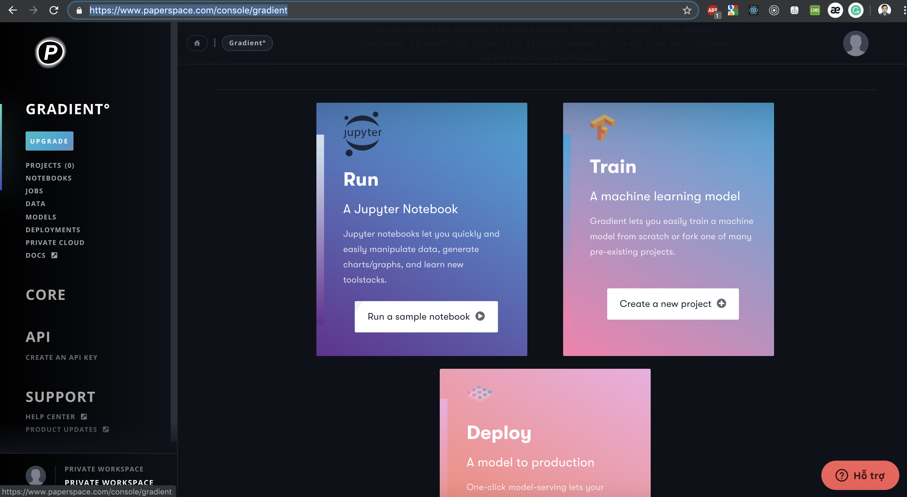
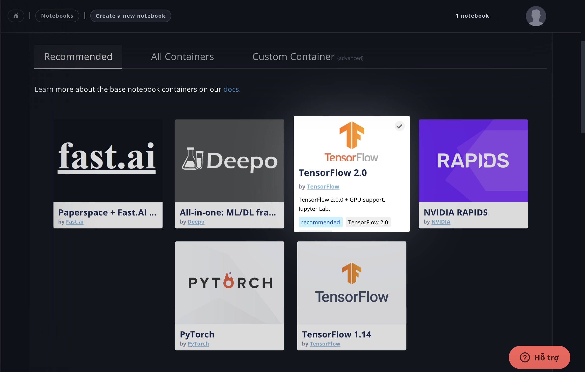
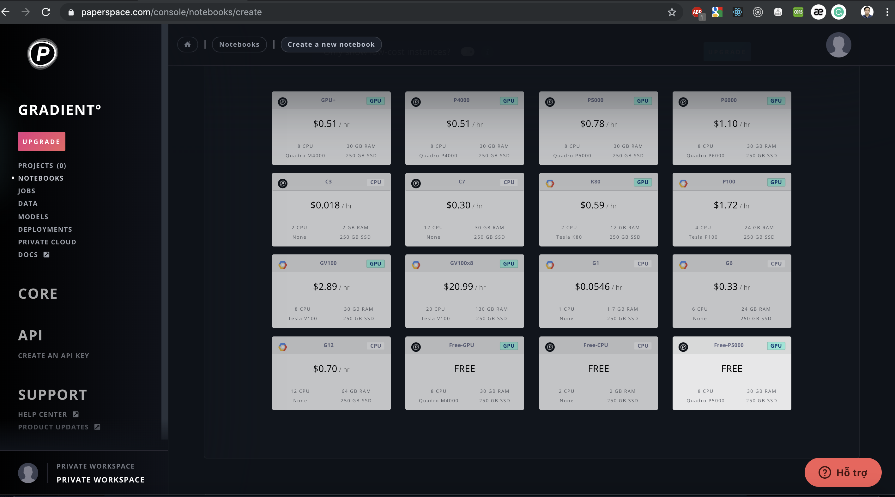
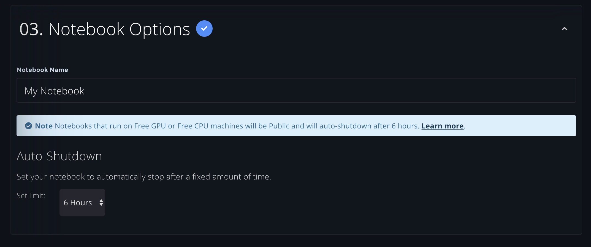
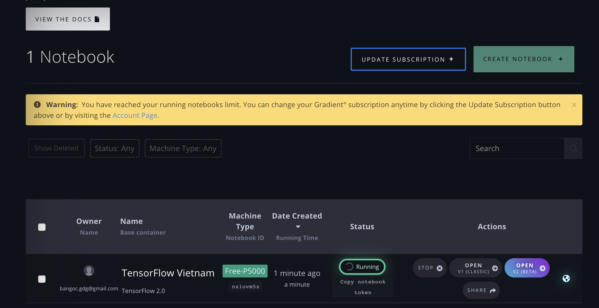
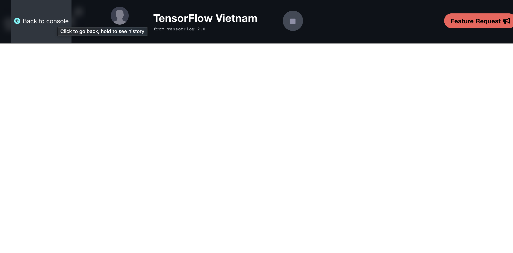
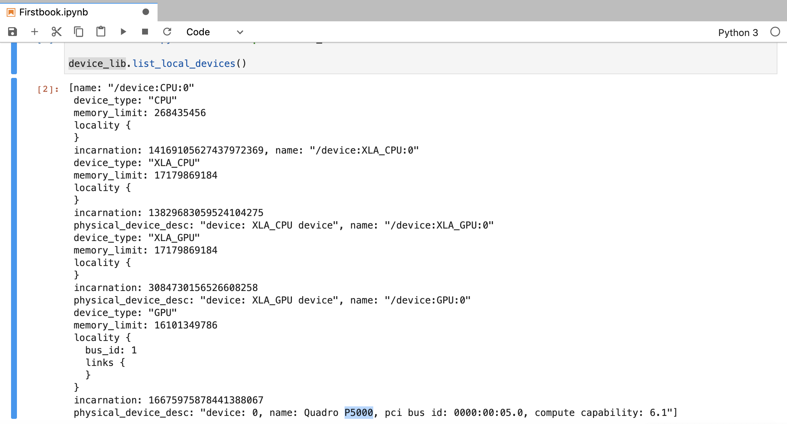
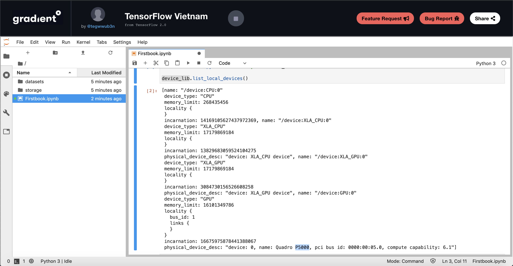
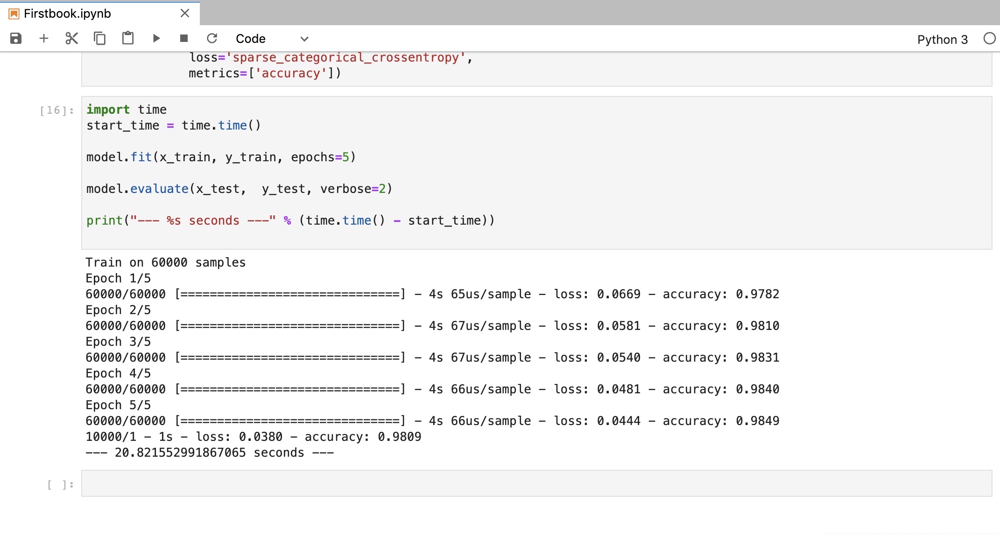

## Một số trải nghiệm lần đầu khi sử dụng PaperSpace Gradient


Chính xác là ngày 11/10/2019, PaperSpace có công bố chương trình [Gradient Community Notebooks](https://blog.paperspace.com/paperspace-launches-gradient-community-notebooks/).

3 loại GPU được free đó là:

- Free-CPU — C3 CPU instance
- Free-GPU+ — NVIDIA M4000 GPU
- Free-P5000 — NVIDIA P5000 GPU


Nào chúng ta cùng sử gói free P5000, rõ ràng P5000 hiệu năng tốt hơn M4000 nên chúng ta sẽ chọn GPU này để test trước.

Link so sánh [ở đây](https://gpu.userbenchmark.com/Compare/Nvidia-Quadro-P5000-vs-Nvidia-Quadro-M4000/m197331vsm37687).


#### Bước 1: Tạo tài khoản [PaperSpace](https://www.paperspace.com/)

Bước này đơn giản rồi nên tôi không đề cập nhiều, chú ý bạn cần thẻ visa/master để đăng ký sử dụng tài nguyên. Việc này chỉ để xác nhận tài khoản của bạn, việc sử dụng free GPU không tốn bất cứ một chi phí nào. Nhưng hay đảm bảo tắt hết mọi thứ trước khi logout để tránh trường hợp xấu nha bạn. :D

Tôi đã tạo tài khoản PaperSpace rất lâu rồi và hi vọng một ngày nào đó free GPU và ngày đó đã đến. :D


#### Bước 2: Truy cập vào [PaperSpace Gradient](https://www.paperspace.com/console/gradient)



Chọn Run một Jupyter Notebook

#### Bước 3: Chọn một Framework để train model



#### Bước 4: Chọn free GPU mà bạn muốn.



Một điều đáng tiếc đó là chúng ta chỉ có thể chạy một Notebook tại một thời điểm duy nhất và 6 tiếng sau notebook sẽ tự động tắt.

Điểm này thì Colab của Google vượt trội hơn hẳn khi bạn có thể bật bao nhiêu Notebook tuỳ thích tại cùng một thời điểm. Nhưng mà chú ý rằng khi mà chúng ta chạy 2 Notebook trên Colab, bản chất Colab chạy cả 2 notebooks trên cùng một container được nối với gmail của bạn. Lợi thế đây chỉ là tiện ích sử dụng mà không phải là lợi thế về tài nguyên.




Notebook sẽ bị tắt sau 6 tiếng, điểm trừ khá lớn đây khi Colab là 12 tiếng. :(

#### Bước 5: Mở Notebook



Một điểm trừ tiếp theo là việc load notebook khá lâu, lúc đầu tôi tưởng hệ thống bị đứng nhưng thực chất hệ thống đang load, hi vọng tình trạng này sẽ được cải thiện trong tương lai.



Một chút về giao diện: Thank Bar bên trên khá lớn  khiến không gian để code bị giảm đi.


#### Bước 6: Kiểm tra GPU

```
from tensorflow.python.client import device_lib

device_lib.list_local_devices()
```



Yeah số hiệu P5000 đã hiện ra.

Giao diện thao tác:




Ở đây chúng ta có thể thấy sự học hỏi khá nhiều từ Colab trong tính năng quản lý thư mục và files. Tôi còn nhớ những thời điểm đầu sử dụng Colab, system này còn chưa có taskbar quản lý file, phải rất vất vả mới kết nối được Google Drive với container của Colab. :(

Đây là [bài viết](http://bit.ly/2PgQwl5) rất lâu rồi mà tôi đã từng viết về setting Colab từ những ngày đầu tiên.

Tôi có test tốc độ upload file của hệ thống này nhưng cũng khá chậm không có gì quá đặc sắc. Vì thế lựa chọn tốt vẫn là kéo dataset từ Internet về, với 300GB SSD cũng không phải con số quá lớn với Deep Learning.


#### Bước 7: Tiến hành Training

Điểm cộng lớn nhất ở đây là tốc độ training khá ấn tượng

 

Chỉ cần 20.82s để có thể train xong 60000 ảnh của bộ dataset MNIST trong 5 epochs. Tôi có cảm giác nhanh hơn K80 ở Colab một chút, yếu tố này có thể phụ thuộc vào lượng người dùng hiện có của 2 bên nên để đưa ra kết luận cuối cùng thì cần một thời gian dài để sử dụng. 

Code training nằm [ở đây](https://www.tensorflow.org/tutorials/quickstart/beginner). 

Đây là những cảm nhận đầu tiên của tôi khi sử dụng nền tảng này. Rõ ràng việc thiếu tài nguyên là rào cản lớn cho những người yêu thích học và thực hành AI. Cho nên việc các công ty lớn công bố những chương trình hỗ trợ Community là hoàn toàn giá trị và ý nghĩa cho sự phát triển chung của ngày công nghệ tương lai này.

Việc còn nhiều thiếu sót là không tránh khỏi nên hi vọng chúng ta có thể ủng hộ và góp ý cho sản phẩm này hoàn thiện hơn.


