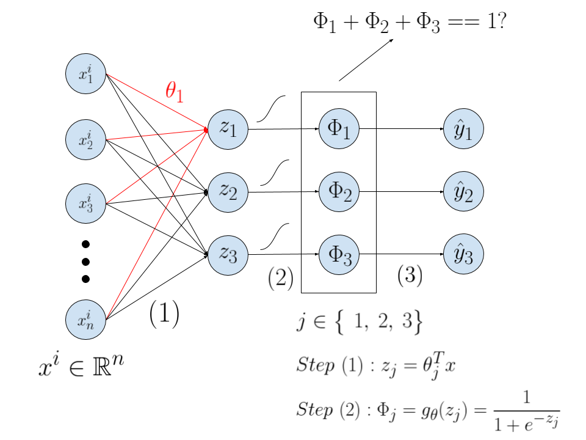
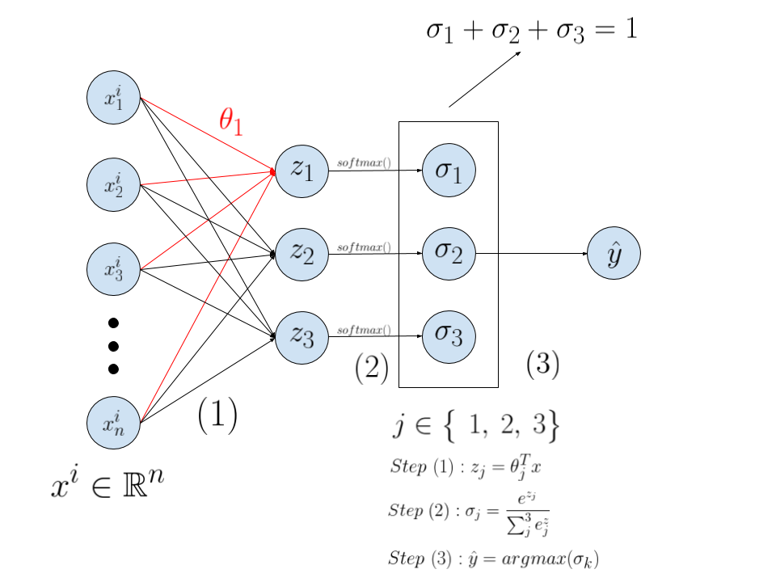
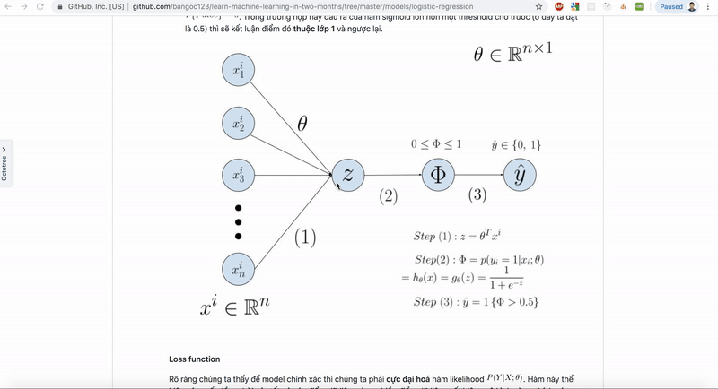

### 5. Bài toán phân loại (Classification)
----

   - **a. Mô hình Hồi quy Logistic (Logistic Regression Model)**
   
        
        
        Như trên hình chúng ta có 2 bài toán phân loại: **Phân loại 2 lớp (Binary Classification)** và **Phân loại nhiều lớp (Multiclass Classification)**. 
        
      - **Phân loại 2 lớp (Binary Classification)**

           - Mô phỏng           
           

           Bài toán ở đây rất đơn giản, cho 1 dữ liệu bất kỳ có giá trị dựa theo trục  và . Làm thế nào ta xác định được điểm đó là thuộc lớp **ô tròn màu đỏ** hay **ô vuông màu xanh**. Vậy chúng ta có thể kết luận đây và bài toán phân loại.
        
      - **Phân loại nhiều lớp (Multiclass Classification)**

           - Mô phỏng
           
           
           
           Tương tự bài toán phân loại 2 lớp, là đầu ra chúng ta cần một điểm thuộc 1 lớp nhất định và điều khác biệt ở đây đó là số lượng lớp luôn lớn hơn 2. Ở trong ví dụ này là 3 lớp. Các model phân biệt ảnh lớn có thể có đến 1000 lớp như [ImageNet](http://www.image-net.org/).

     - **Cách tiếp cận bài toán này**
      
         Tôi sẽ lấy bài phân loại 2 lớp để các bạn hình dung trước. Có 2 cách tiếp cận để giải bài toán này:

         | Discriminative model	 | Generative model|
         | ------ | ------ |
         | Tìm đường ngăn cách (Decision Boundary)	 | Tìm phân bố xác suất của dữ liệu (Probability distributions of the data)|  
         | 	 | |  

         Theo [Supervised Learning cheatsheet](https://stanford.edu/~shervine/teaching/cs-229/cheatsheet-supervised-learning#linear-models)
         
      - **Tiếp cận theo hướng Discriminative**
		Nhắc lại chúng ta sẽ tìm một đường ngăn cách để có thể phân biệt 2 vùng data với trường hợp phân loại 2 lớp hoặc nhiều vùng data trong trường hợp phân loại nhiều lớp.

		Trong trường hợp phân loại 2 lớp:
		
		
	
		Phân bố xác suất:
		
		Xác suất 1 điểm là màu xanh:
	
		

		Xác suất 1 điểm là màu đỏ: 

		

        Viết gọn lại 2 công thức bên trên ta sẽ được:

        

        - 

        - 

        Đoạn này bạn có thấy giống [Phân phối Bernoulli](https://vi.wikipedia.org/wiki/Ph%C3%A2n_ph%E1%BB%91i_Bernoulli) không?
        
        Chú ý rằng đây mới là xác suất của **một điểm** sẽ là xanh hay đỏ. Bài toán của chúng ta cần xét trên toàn bộ tập **data set**.

         với  và 

        Vì  là các biến độc lập nhau cho nên:

        

        Đọc thêm về [Biến cố độc lập](https://vi.wikipedia.org/wiki/%C4%90%E1%BB%99c_l%E1%BA%ADp_th%E1%BB%91ng_k%C3%AA) để hiểu tại sao lại sử dụng tích này.        

        **Hàm sigmoid**

        Ở đây ta sử dụng hàm sigmoid: 

        

        Trong đó:

        

        Kết hợp với hàm số (4) ta có:

        
		
		Vậy tại sao phải sử dụng hàm này: Bạn chú rằng đầu ra của bài toán này chỉ là 2 giá trị **0** và **1** mà không phải là vô số giá trị thuộc tập số thực giống như [bài toán hồi quy tuyến tính]([https://github.com/bangoc123/learn-machine-learning-in-two-months/tree/master/models/linear-regression](https://github.com/bangoc123/learn-machine-learning-in-two-months/tree/master/models/linear-regression)).
		
		Hàm sigmoid sẽ giúp đầu ra của biểu thức  giới hạn trong khoảng **[0,1]**, Việc chuyển đổi này thoả mãn nhu cầu cần tìm ra xác suất của một điểm bất kỳ là xanh hay đỏ ở công thức (1) và (2) ( giá trị này nhỏ nhất bằng **0** và lớn nhất bằng **1**) :
		
		
	
		Nhìn vào đồ thị chúng ta có thể thấy, dù   có lớn thế nào thì đầu ra của hàm tối đa là **1**, cũng như kết quả của  có nhỏ cỡ nào thì đầu ra của hàm tối đa là **0**.

        **Toàn bộ quy trình học từ một cặp dữ liệu**. Quá trình này được biểu diễn dưới một mạng neuron đơn giản.

        - Bước 1: Nhân vector.  là một điểm dữ liệu có chiều (nx1).  có chiều (nx1). Sau này đến bài mạng neuron bạn sẽ học kỹ hơn về chiều của tham số.
        - Bước 2: Phép biến đổi phi tuyến, chuyển từ giá trị bất kỳ z về một giá trị nhỏ hơn 1 và lớn hơn 0 thông qua hàm **sigmoid**.
        - Từ xác suất này kết luận là điểm dữ liệu này thuộc lớp 0 hay lớp 1. Giải thích ký hiệu:  và . Trong trường hợp này đầu ra của hàm sigmoid lớn hơn một threshold cho trước (ở đây ta đặt là 0.5) thì sẽ kết luận điểm đó **thuộc lớp 1** và ngược lại.

        

        **Loss function**

        Rõ ràng chúng ta thấy để model chính xác thì chúng ta phải **cực đại hoá** hàm likelihood . Hàm này thể hiện xác suất đồng thời xảy tất cả các điểm dữ liệu, càng nhiều điểm dữ liệu xuất hiện, mô hình càng chính xác.

        Xem thêm về [Cực đại hoá Likelihood](https://en.wikipedia.org/wiki/Maximum_likelihood_estimation).

        <a href="https://www.codecogs.com/eqnedit.php?latex=\small&space;max&space;\&space;P(Y|X;&space;\theta)&space;\Leftrightarrow&space;max&space;\&space;log&space;P(Y|X;&space;\theta)&space;\Leftrightarrow&space;max&space;\&space;log(\prod_{i}^{m}&space;h_{\theta}(x_i)^{y_i}&space;(1-h_{\theta}(x_i))^{1-y_i})&space;\Leftrightarrow&space;max&space;\&space;\sum_{i}^{m}&space;y_i&space;log(h_\theta(x_i))&space;&plus;&space;(1-y_i)log(1-h_\theta(x_i))&space;\Leftrightarrow&space;min&space;\&space;\frac{-1}{m}&space;\sum_{i}^{m}&space;y_i&space;log(h_\theta(x_i))&space;&plus;&space;(1-y_i)log(1-h_\theta(x_i))&space;\Leftrightarrow&space;min&space;\&space;J(\theta)" target="_blank"></a>

        Chú ý ta cần lấy log để tránh trường hợp khi số lượng điểm dữ liệu quá lớn dẫn đến tích của nhiều số nhỏ hơn 0 sẽ tiệm cận về không. Vì thế thay vì sử dụng phép tích, chúng ta dùng hàm log để việc cực đại **tích này** thành cực đại **một tổng**.

        Vì vậy:

        Hàm Loss Function của chúng ta chính là:

        

          

          **Tối ưu Loss Function**

          Tương tự bài toán Linear Regress, chúng ta sẽ sử dụng thuật toán **Gradient Descent**.

          Cập nhật  sao cho hàm Loss nhỏ nhất có thể:

          

          Công thức tính đạo hàm riêng của các phần tử trong :

          

          Vậy câu hỏi đặt ra tiếp theo rằng nếu chỉ sử dụng hàm **sigmoid** có thể đúng xử lý bài toán phân loại nhiều lớp không?

   - **b. Tiếp cận bài toán phân loại nhiều lớp**

        Để trả lời câu hỏi bên trên ta có thể vẽ lại mô hình phân loại:

        

        Các bạn đừng sợ khi nhìn vào ảnh này. Đây chỉ là cách biểu thị các phép tính toán.

        Ở bước 1, việc các mũi tên trỏ vào  thể  hiện phép nhân . 
        
        Bản chất mô hình này có thể coi là một Neural Network với 1 lớp ẩn. Vấn đề này sẽ được đề cập đến trong bài tiếp theo.

        Có thể nhận ra rằng mục tiêu của chúng ta là phân phối được tạo ra khi đi qua hàm **signmoid** phải thoả mãn tổng bằng 1. Nhưng điều này không được đảm bảo.

        Vì thế khả năng dự đoán của mô hình không còn chính xác. Cho nên, ta cần một thuật toán có tên **Softmax Regression**.

        Công thức của hàm Softmax:

        

        Trong đó **K** là số lớp.

        Áp dụng vào trường hợp bên trên ta có:

        

        Ta có biểu đồ mới:

        

        Rõ ràng ta có thể thấy rằng hàm Softmax đã chuyển phân phối của  về phân phối của  sao cho thoả mãn điều kiện là tổng các  bằng 1.

        Và dĩ nhiên rằng giá trị  lớn nhất sẽ đại diện cho lớp mà ta dự đoán ra.

        Lúc này hàm Loss Function sẽ có dạng:

        

        Nếu bạn thay K bằng 2 vào công thức này sẽ được chính hàm mất mát của bài toán phân loại 2 lớp.
- **c. Mô phỏng hoá quá trình Training**

    

    Quan sát ảnh động này ta sẽ thấy quá trình training sẽ diễn ra thế nào, lúc đầu khi khởi tạo  độ sai lệch sẽ rất lớn. Nhưng khi cập nhật  thì đường thẳng  đã có khả năng phân biệt giữa 2 lớp.

    Thử nghiệm [tại đây](https://playground.tensorflow.org/#activation=tanh&regularization=L1&batchSize=19&dataset=gauss&regDataset=reg-plane&learningRate=0.01&regularizationRate=0&noise=30&networkShape=3&seed=0.49475&showTestData=false&discretize=false&percTrainData=70&x=true&y=true&xTimesY=false&xSquared=false&ySquared=false&cosX=false&sinX=false&cosY=false&sinY=false&collectStats=false&problem=classification&initZero=false&hideText=false)

