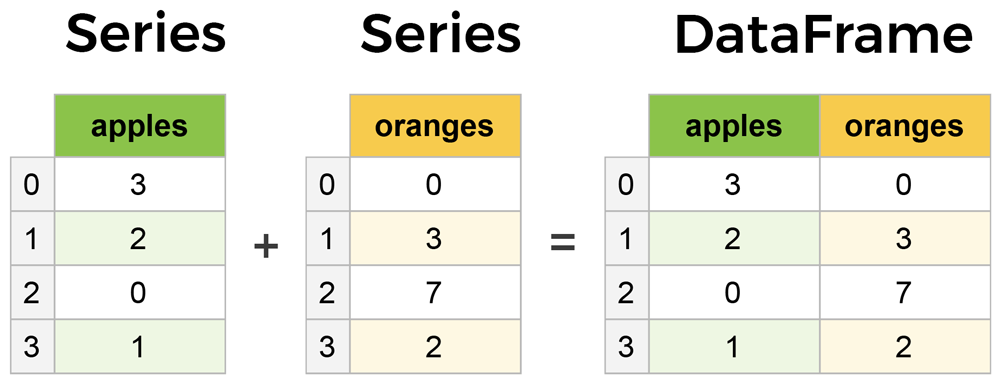

### Pandas
- Một số tính năng của Pandas
    -  Tiện lợi cho việc xử lý data dưới dạng bảng
    -  Được xây dựng trên Numpy nên rất mạnh mẽ
- Cài đặt
    - **pip install pandas**
- Thực hành
    - [Series - Chuỗi data]("./Series.ipynb")
    - DataFrame
        - Phân biệt: Một cách hiểu đơn giản là Series là hiển thị dữ liệu dạng key-value dưới dạng 1 cột còn Dataframe sẽ là ghép nhiều cột series thành một bảng.

        

        [Nguồn ảnh](https://www.learndatasci.com/tutorials/python-pandas-tutorial-complete-introduction-for-beginners/)
       
        - [Khởi tạo DataFrame và truy xuất dữ liệu](./DataFrameCreateRead.ipynb)